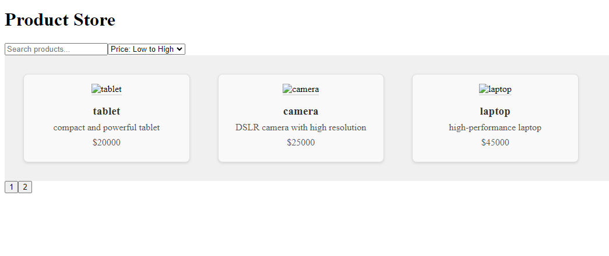

# Product Store

Welcome to the Product Store application! This application allows users to view and manage a list of products. It features a responsive grid layout for displaying products, a search function, and sorting options.

## Screenshots

Here's a preview of what the application looks like:



## Features

- **Responsive Design**: The application is designed to be responsive and adjusts to different screen sizes.
- **Product Search**: Users can search for products using the search bar.
- **Sorting Options**: Sort products by price, either low to high or high to low.
- **Pagination**: Navigate through pages of products easily.

## Installation

To get started with this project, follow these steps:

1. **Clone the Repository**

   ```bash
   git clone https://github.com/your-username/product-store.git
   cd product-store
